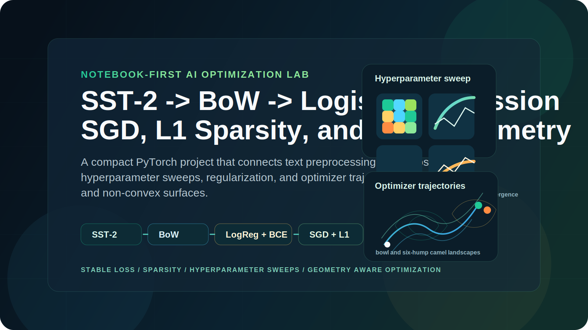

<div align="center">
  

  <h1>PyTorch Optimization Lab</h1>
  <p><strong>Notebook-first study of optimization, regularization, and text classification</strong> built around SST-2, Bag-of-Words logistic regression, SGD sweeps, L1 sparsity, and optimizer trajectories on convex and non-convex loss surfaces.</p>

  <p>
    
    
    
    
    
  </p>
</div>

## Overview

This repo turns a coursework notebook into a compact, reproducible optimization lab. The main artifact is [`notebooks/LLM_Architectures_hometask_1.ipynb`](notebooks/LLM_Architectures_hometask_1.ipynb), which starts with raw SST-2 text, builds a Bag-of-Words pipeline, implements logistic regression with PyTorch primitives, and then studies how optimization choices affect learning dynamics and sparsity.

It is useful as:

- a hands-on walkthrough of stable binary classification in PyTorch
- a small experiment lab for SGD, L1 regularization, and hyperparameter sweeps
- a visual comparison of first-order optimizers on convex and non-convex objectives

## At A Glance

```text
SST-2 text
  -> cleaning
  -> tokenization
  -> top-k vocabulary
  -> Bag-of-Words vectors
  -> LogisticRegression
  -> stable binary cross-entropy
  -> SGD / L1 regularization
  -> heatmaps, sparsity plots, parameter trajectories

theta = (x, y)
  -> GD / Momentum / AdaGrad / Adam
  -> convex bowl + six-hump camel
  -> value curves + optimizer trajectories
```

## Highlights

- End-to-end SST-2 preprocessing: cleaning, tokenization, vocabulary construction, and count-vector features
- Logistic regression implemented from scratch with PyTorch tensors and modules
- Numerically stable binary cross-entropy and softmax discussion
- Learning-rate and batch-size sweeps with accuracy and log-loss heatmaps
- L1 regularization experiments with sparsity counts and weight-dynamics plots
- Gradient Descent, Momentum, AdaGrad, and Adam compared on both a convex bowl and the six-hump camel function

## Notebook Coverage

| Section | Focus | Outputs |
| --- | --- | --- |
| Dataset preparation | SST-2 cleaning, tokenization, vocabulary building, vectorization | label stats, vocabulary size, sparse count vectors |
| Part 1.1 | Numerical stability in BCE and softmax | written explanation, stable BCE implementation |
| Part 1.2-1.3 | Logistic regression and mini-batch SGD | model class, training loop, parameter history |
| Part 1.4 | Hyperparameter sweeps | train and validation accuracy heatmaps, log-loss heatmaps, summary analysis |
| Part 1.5 | L1 regularization and sparsity | lambda sweep, initialization comparison, non-zero counts, weight-dynamics plots |
| Part 2 | Optimizer geometry | GD, Momentum, AdaGrad, Adam on bowl and camel functions |
| Bonus | Why plain L1 SGD hovers near zero | proximal vs subgradient vs L2 toy example |

## Run It Locally

```bash
bash scripts/start_jupyter.sh
```

Then open:

- [`notebooks/LLM_Architectures_hometask_1.ipynb`](notebooks/LLM_Architectures_hometask_1.ipynb)

For a clean rerun:

1. Start Jupyter with `bash scripts/start_jupyter.sh`.
2. Open the notebook.
3. Restart the kernel.
4. Run all cells from top to bottom.

The launcher bootstraps `.venv/` if needed, installs [`requirements.txt`](requirements.txt), and keeps Jupyter, Matplotlib, and Hugging Face cache/config files inside the project.

## Environment Notes

- Python 3.10+ is recommended
- the first SST-2 download requires internet access once
- downloaded datasets are cached under `.cache/huggingface/`
- the notebook contains a `!pip install datasets` cell near the top, but `datasets` is already listed in [`requirements.txt`](requirements.txt)
- Jupyter may recreate helper directories such as `notebooks/.ipynb_checkpoints/`; they are safe to ignore

## Repo Layout

```text
pytorch-optimization-lab/
├── assets/
│   └── optimization-lab-hero.svg
├── notebooks/
│   └── LLM_Architectures_hometask_1.ipynb
├── scripts/
│   └── start_jupyter.sh
├── LICENSE
├── README.md
└── requirements.txt
```

## Why This Repo Is Worth Opening

This project keeps the interesting parts visible: feature construction, loss design, optimization behavior, and failure modes. Instead of hiding the learning process behind high-level training utilities, it shows how the pipeline works end to end and makes optimizer behavior easy to inspect through plots and controlled experiments.

## License

MIT. See [`LICENSE`](LICENSE).
