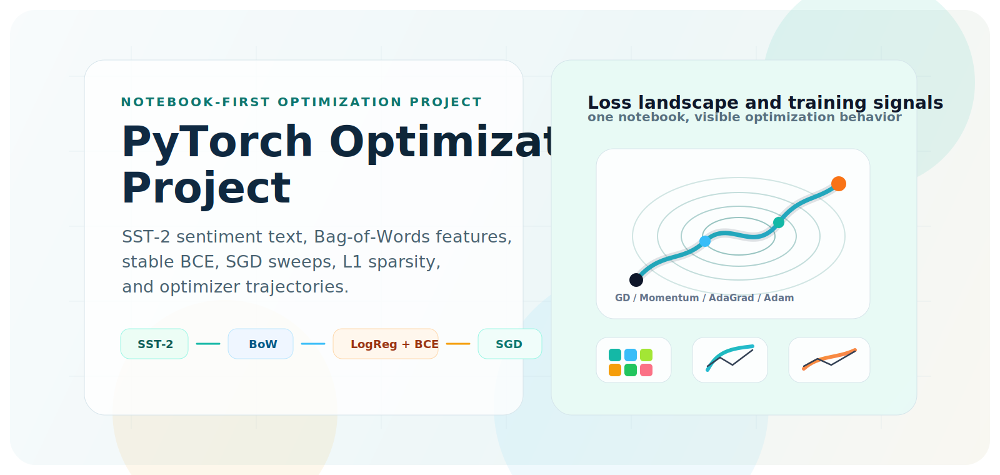
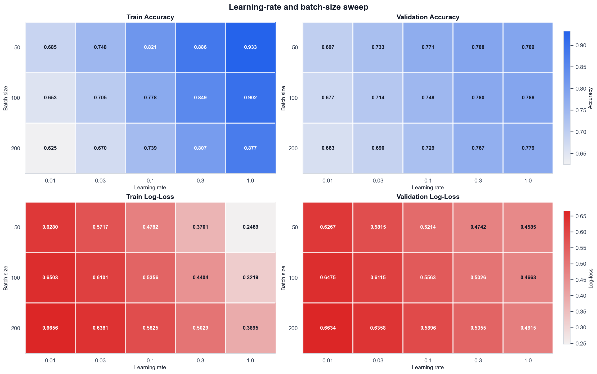
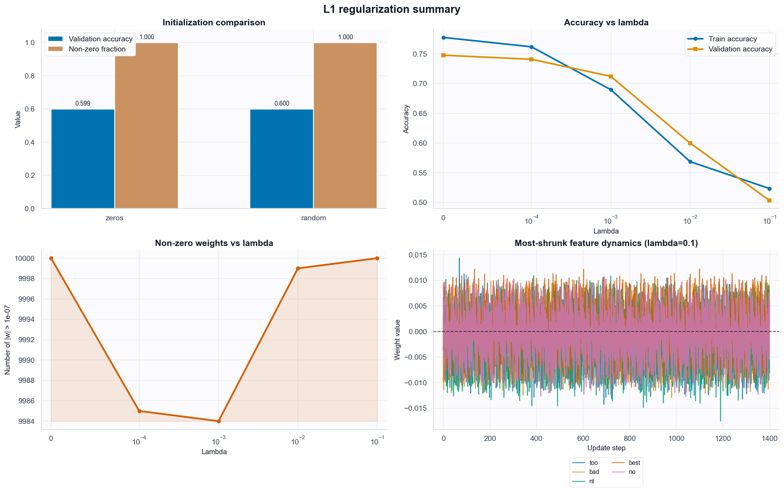
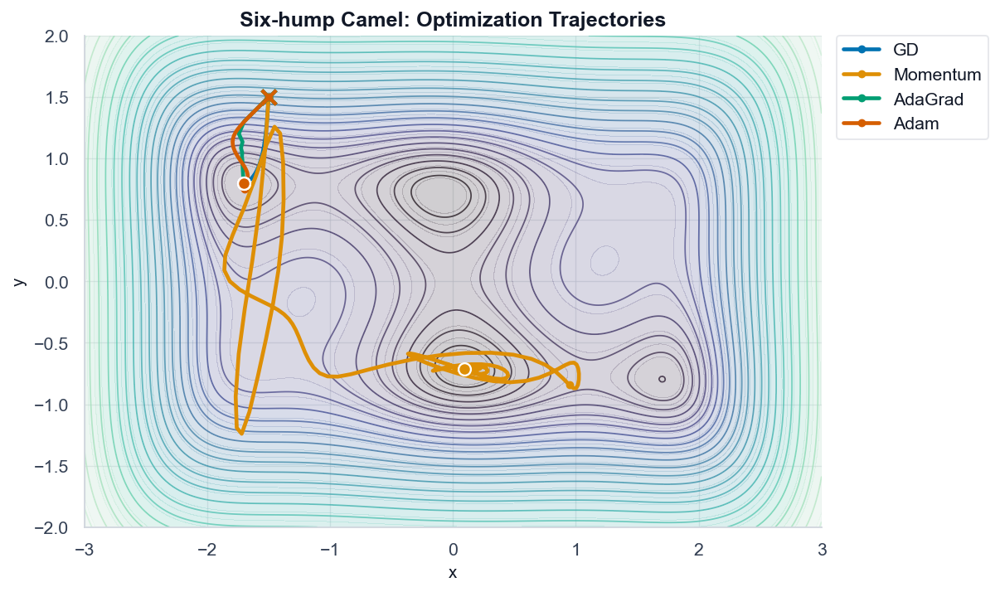
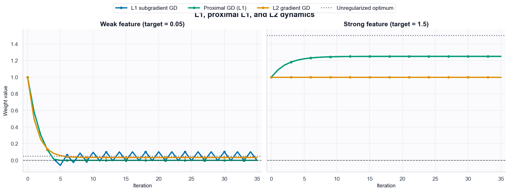

<div align="center">
  

  <h1>PyTorch Optimization Project</h1>
  <p><strong>A notebook-first project for text classification, SGD dynamics, L1 sparsity, and optimizer geometry.</strong></p>

  <p>
    
    
    
    
    
  </p>
</div>

## What This Is

This repository packages [`notebooks/LLM_Architectures.ipynb`](notebooks/LLM_Architectures.ipynb) as a reproducible optimization project. It starts with SST-2 sentiment text, builds a Bag-of-Words logistic regression model in PyTorch, then studies how learning rate, batch size, L1 regularization, and optimizer choice change the training behavior.

The project is intentionally transparent: the notebook implements the core model, loss, training loop, and optimizer experiments directly instead of hiding them behind high-level training utilities.

## Latest Notebook Outputs

These images are exported from the last successful end-to-end notebook run.

| Hyperparameter sweep | L1 regularization |
| --- | --- |
|  |  |

| Optimizer geometry | Proximal L1 behavior |
| --- | --- |
|  |  |

## Workflow

```text
SST-2 text
  -> cleaning
  -> tokenization
  -> top-k vocabulary
  -> Bag-of-Words vectors
  -> PyTorch logistic regression
  -> stable binary cross-entropy
  -> SGD sweeps
  -> L1 sparsity analysis

2D objective surfaces
  -> GD, Momentum, AdaGrad, Adam
  -> convex bowl
  -> six-hump camel
  -> trajectory and value-curve comparisons
```

## Quickstart

Create a local Hugging Face token file:

```bash
cp env.template env
```

Edit `env` and replace the placeholder:

```bash
HF_TOKEN=YOUR_HF_TOKEN
```

The real `env` file is ignored by git. Both `run_project.sh` and the notebook read `HF_TOKEN` from it.

Start Jupyter:

```bash
bash run_project.sh
```

Use another port if `8888` is busy:

```bash
PORT=8890 bash run_project.sh
```

Then open [`notebooks/LLM_Architectures.ipynb`](notebooks/LLM_Architectures.ipynb).

For a clean rerun:

1. Start Jupyter with `bash run_project.sh`.
2. Open the notebook.
3. Restart the kernel.
4. Run all cells from top to bottom.

## What The Notebook Covers

| Section | Focus | Main outputs |
| --- | --- | --- |
| Dataset preparation | SST-2 loading, cleaning, tokenization, vocabulary, vectors | label stats, vocabulary size, sparse count vectors |
| Numerical stability | BCE and softmax stability | stable loss implementation and written explanation |
| Logistic regression | PyTorch module, sigmoid probabilities, SGD loop | train/validation loss and accuracy |
| Hyperparameter sweep | learning rate and batch size grid | accuracy heatmaps, log-loss heatmaps, convergence analysis |
| L1 regularization | zero/random init, lambda sweep, feature shrinkage | sparsity counts, weight dynamics, summary plots |
| Optimizer geometry | GD, Momentum, AdaGrad, Adam | value curves and 2D trajectories |
| Bonus | subgradient L1 vs proximal L1 vs L2 | toy dynamics explaining exact zeros |

## Environment Notes

- Python 3.10-3.12 is required for the pinned dependency set.
- `run_project.sh` creates `.venv/`, installs Jupyter, and keeps cache/config files inside `.cache/`.
- If a compatible Python is missing, the launcher attempts installation through Homebrew, `apt-get`, `dnf`, `yum`, `pacman`, or `apk`.
- The first dataset download needs internet access; later runs use `.cache/huggingface/`.
- The notebook contains the pinned `%pip install ...` cell for project dependencies.
- Jupyter may recreate helper folders such as `notebooks/.ipynb_checkpoints/`; they are ignored.

## Reference Trail

I used these sources to keep the README aligned with common PyTorch/Jupyter project conventions and the dataset/tooling this notebook uses:

| Area | Source |
| --- | --- |
| PyTorch training loop | [PyTorch tutorial: Optimizing Model Parameters](https://docs.pytorch.org/tutorials/beginner/basics/optimization_tutorial.html) |
| PyTorch optimizer API | [torch.optim documentation](https://docs.pytorch.org/docs/stable/optim.html) |
| PyTorch example repo style | [pytorch/examples on GitHub](https://github.com/pytorch/examples) |
| PyTorch tutorial repo style | [pytorch/tutorials on GitHub](https://github.com/pytorch/tutorials) |
| Dataset background | [stanfordnlp/sst2 dataset card](https://huggingface.co/datasets/stanfordnlp/sst2) |
| `SetFit/sst2` loading pattern | [SetFit quickstart](https://huggingface.co/docs/setfit/en/quickstart) |
| SetFit repository context | [huggingface/setfit on GitHub](https://github.com/huggingface/setfit) |
| GitLab notebook repo examples | [KLimPALE/Deep_Learning_School](https://gitlab.com/KLimPALE/Deep_Learning_School), [GitLab PyTorch topic](https://gitlab.com/explore/projects/topics/pytorch), [GitLab Jupyter Notebook topic](https://gitlab.com/explore/projects/topics/Jupyter%20notebook), [GitLab optimization topic](https://gitlab.com/explore/projects/topics/optimization) |

## Repo Layout

```text
pytorch-optimization-project/
├── assets/
│   ├── optimization-project-hero.svg
│   ├── readme-camel-trajectories.png
│   ├── readme-l1-regularization.png
│   ├── readme-learning-rate-sweep.png
│   └── readme-proximal-l1.png
├── notebooks/
│   └── LLM_Architectures.ipynb
├── env.template
├── LICENSE
├── README.md
└── run_project.sh
```

## Current Run Status

The notebook was last executed end to end with updated outputs saved in place:

- errors: `0`
- warnings: `0`
- unexecuted code cells: `0`

## License

MIT. See [`LICENSE`](LICENSE).
